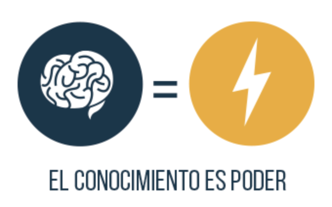

#Regresión Linear Simple (R)
La regresión linear utiliza el método de mínimos cuadrados para encontrar la recta que resulta en la menor suma de errores al cuadrado (RMSE: Root Mean Square Error).
La palabra simple se refiere a que la variable respuesta solo depende de 1 variable independiente: Y = f(X)


Escenario del problema
---


Queremos encontrar la relación que existe entre los años de experiencia profesional y el salario que podemos esperar tener cuando lo hayamos conseguido.  
¡Vamos a ello!

```{r 1. Importar librerías}
# 1. Importar librerías
library(caTools)
library(ggplot2)
```

```{r 2. Importar datos}
# 2. Importar datos
datos <- read.csv('../Datos/4.1.Salarios.csv')
```

```{r # 3. Separar en Entrenamiento y Validación}
# 3. Separar en Entrenamiento y Validación
set.seed(123)
split <- sample.split(datos$Salario, SplitRatio = 0.7)
entrenamiento <- subset(datos, split==TRUE)
validacion    <- subset(datos, split==FALSE)
train <- entrenamiento
test  <- validacion
```

```{r # 4. Construir el Modelo}
# 4. Construir el Modelo
regresor <- lm(formula = Salario ~ Experiencia,
               data = train) 
```

```{r 5. Hacer las prediciones para el conjunto de Validación}
# 5. Hacer las prediciones para el conjunto de Validación
y_fit  <- predict(regresor, newdata = train)
y_pred <- predict(regresor, newdata = test) 
```

```{r 6. Echemos un vistazo a la pinta que tienen las predicciones}
# 6. Echemos un vistazo a la pinta que tienen las predicciones
# 6.1. Para el conjunto de entrenamiento
ggplot() +
  geom_point(aes(train$Experiencia, train$Salario), colour='red') +
  geom_line(aes(train$Experiencia, y_fit), colour='blue') +
  ggtitle('Regresión Linear Simple') +
  xlab('Años de experiencia') +
  ylab('Salario')

# 6.2. Para el conjunto de validación
ggplot() +
  geom_point(aes(test$Experiencia, test$Salario), colour='red') +
  geom_line(aes(test$Experiencia, y_pred), colour='blue') +
  ggtitle('Regresión Linear Simple') +
  xlab('Años de experiencia') +
  ylab('Salario')
```

```{r 7. Calcular el error}
# 7. Calcular el error
library(Metrics)
RMSE <- rmse(test$Salario, y_pred)
print(RMSE)
```
