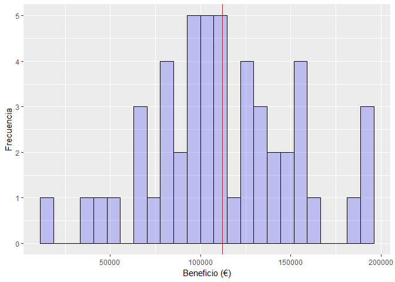

#Regresión Linear Múltiple (R)
La regresión linear utiliza el método de mínimos cuadrados para encontrar la recta que resulta en la menor suma de errores al cuadrado (RMSE: Root Mean Square Error).
La palabra múltiple se refiere a que la variable respuesta dependerá de más de 1 variable independiente: Y = f(X1,...,Xn)


Escenario del problema
---


Queremos encontrar la relación que existe entre un conjunto de variables y el salario que podemos esperar tener cuando lo hayamos conseguido.
¡Vamos a ello!

<br>
<br>

```r
# 1. Importar librerías
library(caTools)
library(ggplot2)
```


```r
# 2. Importar datos
datos <- read.csv('../Datos/4.1.Empresas.csv')
```


```r
# 3. Codificcar variables categóricas
datos$Pais <- factor(datos$Pais, 
                     levels = c('Nueva York', 'California', 'Florida'),
                     labels = c(1, 2, 3))
datos
```

```
##    Investigacion Administracion Marketing Pais Beneficio
## 1      165349.20      136897.80 471784.10    1 192261.83
## 2      162597.70      151377.59 443898.53    2 191792.06
## 3      153441.51      101145.55 407934.54    3 191050.39
## 4      144372.41      118671.85 383199.62    1 182901.99
## 5      142107.34       91391.77 366168.42    3 166187.94
## 6      131876.90       99814.71 362861.36    1 156991.12
## 7      134615.46      147198.87 127716.82    2 156122.51
## 8      130298.13      145530.06 323876.68    3 155752.60
## 9      120542.52      148718.95 311613.29    1 152211.77
## 10     123334.88      108679.17 304981.62    2 149759.96
## 11     101913.08      110594.11 229160.95    3 146121.95
## 12     100671.96       91790.61 249744.55    2 144259.40
## 13      93863.75      127320.38 249839.44    3 141585.52
## 14      91992.39      135495.07 252664.93    2 134307.35
## 15     119943.24      156547.42 256512.92    3 132602.65
## 16     114523.61      122616.84 261776.23    1 129917.04
## 17      78013.11      121597.55 264346.06    2 126992.93
## 18      94657.16      145077.58 282574.31    1 125370.37
## 19      91749.16      114175.79 294919.57    3 124266.90
## 20      86419.70      153514.11      0.00    1 122776.86
## 21      76253.86      113867.30 298664.47    2 118474.03
## 22      78389.47      153773.43 299737.29    1 111313.02
## 23      73994.56      122782.75 303319.26    3 110352.25
## 24      67532.53      105751.03 304768.73    3 108733.99
## 25      77044.01       99281.34 140574.81    1 108552.04
## 26      64664.71      139553.16 137962.62    2 107404.34
## 27      75328.87      144135.98 134050.07    3 105733.54
## 28      72107.60      127864.55 353183.81    1 105008.31
## 29      66051.52      182645.56 118148.20    3 103282.38
## 30      65605.48      153032.06 107138.38    1 101004.64
## 31      61994.48      115641.28  91131.24    3  99937.59
## 32      61136.38      152701.92  88218.23    1  97483.56
## 33      63408.86      129219.61  46085.25    2  97427.84
## 34      55493.95      103057.49 214634.81    3  96778.92
## 35      46426.07      157693.92 210797.67    2  96712.80
## 36      46014.02       85047.44 205517.64    1  96479.51
## 37      28663.76      127056.21 201126.82    3  90708.19
## 38      44069.95       51283.14 197029.42    2  89949.14
## 39      20229.59       65947.93 185265.10    1  81229.06
## 40      38558.51       82982.09 174999.30    2  81005.76
## 41      28754.33      118546.05 172795.67    2  78239.91
## 42      27892.92       84710.77 164470.71    3  77798.83
## 43      23640.93       96189.63 148001.11    2  71498.49
## 44      15505.73      127382.30  35534.17    1  69758.98
## 45      22177.74      154806.14  28334.72    2  65200.33
## 46       1000.23      124153.04   1903.93    1  64926.08
## 47       1315.46      115816.21 297114.46    3  49490.75
## 48          0.00      135426.92      0.00    2  42559.73
## 49        542.05       51743.15      0.00    1  35673.41
## 50          0.00      116983.80  45173.06    2  14681.40
```

```r
ggplot(data = datos, aes(datos$Beneficio)) + 
  geom_histogram(bins = 25,
                 col = 'black',
                 fill = 'blue', 
                 alpha = 0.2) + 
  xlab('Beneficio (€)') + 
  ylab('Frecuencia') + 
  geom_vline(xintercept = mean(datos$Beneficio), col='brown')
```

<!-- -->


```r
# 3. Separar en Entrenamiento y Validación
set.seed(123)
split <- sample.split(datos$Beneficio, SplitRatio = 0.7)
entrenamiento <- subset(datos, split==TRUE)
validacion    <- subset(datos, split==FALSE)
train <- entrenamiento
test  <- validacion
```


```r
# 4. Construir el Modelo
regresor <- lm(formula = Beneficio ~ .,
               data = train) 
```


```r
# 5. Hacer las prediciones para el conjunto de Validación
y_fit  <- predict(regresor, newdata = train)
y_pred <- predict(regresor, newdata = test) 
```


```r
# 7. Calcular el error
library(Metrics)
y_real <- test$Beneficio
RMSE <- rmse(y_real, y_pred)
avg <- mean(datos$Beneficio)
err <- (RMSE * 100) / avg 
cat('RMSE is ', RMSE, ' over an average of: ', avg, '; consisting on an error of: ', err, '%')
```

```
## RMSE is  12062.72  over an average of:  112012.6 ; consisting on an error of:  10.76907 %
```


