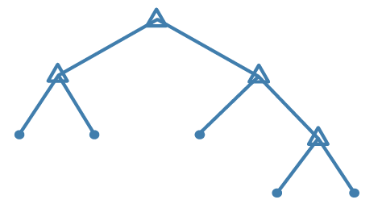

Los árboles de decisión son una de las técnicas más empleadas para el aprendizaje inductivo, siendo un método bastante robusto frente a datos ruidosos. En esencia como todos los regresores, son una función que dará salida a unas entradas. La representación de esta función toma dorma de árbol y es interpretada como una **serie de condiciones consecutivas** que pueden ser fácilmente mapeadas a reglas.

Exiten diferentes algoritmos para la creación de los árboles, en función del método de selección de atributos. Los métodos de seleción de atributos más comunes son: el Índice de Gini, la Ganancia de Información y la Proporción de Ganancia.

El resultado final será un árbol que empieza en un nodo raíz y termina en los nodos hojas. Los caminos desde el nodo raíz a cada uno de los nodos hojas son las ramas, que no son más que secuencias de reglas encadenadas. El resultado de haber llegado a un nodo hoja implica que se han cumplido una por una todas las condiciones en cada una de las ramificaciones de cada nodo intermedio.


Escenario del problema
---


Vamos a contratar un nuevo empleado. Nos ha dicho que en su anterior empresa fue Manager Regional durante 2 años y que cobraba 170.000€ al año. Queremos determinar hasta que punto nos dice la verdad para poder negociar con él el salario que queremos ofrecerle en su nuevo puesto.  
¡Vamos a ello!

```{r 1. Importar librerías}
# 1. Importar librerías
library(caTools)
library(ggplot2)
library(rpart)    # Librería que usaremos para crer el Árbol
```

```{r 2. Importar datos}
# 2. Importar datos
datos <- read.csv('../Datos/4.1.Salarios2.csv')
datos <- datos[2:3] # Eliminamos la columna del título del puesto y nos quedamos con el nivel
head(datos, 10)
```
Vemos como NO existe una tendencia lineal

```{r # 3. Separar en Entrenamiento y Validación}
# 3. Separar en Entrenamiento y Validación
```
**Recordatorio:** no hacemos división de conjuntos porque tenemos muy pocos datos y nuestra intención es hacer una predicción lo más precisa posible.

```{r # 4. Construir el Modelo}
# 4. Construir el Modelo
arbol <- rpart::rpart(formula = Salario ~ Nivel,
                                data = datos)
```

```{r 5. Hacer las prediciones para el conjunto de Validación}
# 5. Hacer las prediciones para el conjunto de Validación
y_fit  <- predict(arbol, newdata = datos)
y_pred <- predict(arbol, data.frame(Nivel = 6.5))
```
No estamos prediciendo en este ejemplo, sino determinando los parámetros para que el modelo se **ajuste** lo mejor posible a los datos del conjunto de entrenamiento (que constitutye todos los datos)

```{r 6. Echemos un vistazo a la pinta que tienen las predicciones}
# 6. Echemos un vistazo a la pinta que tienen las predicciones
ggplot() +
  geom_point(aes(datos$Nivel, datos$Salario), colour='red') +
  geom_line(aes(datos$Nivel, y_fit), colour='blue') +
  ggtitle('Regresión por Árbol de Decisión') +
  xlab('Años de experiencia') +
  ylab('Salario')
```

¡Trampa! Nuestro árbol ha hecho 1 sola división y ha cogido el valor medio. Tenemos que forzar al árbol ha hacer un mínimo de divisiones. Volvamos a configurarlo

```{r 7. Reconstruir el Modelo}
# 4. Construir el Modelo
arbol2 <- rpart::rpart(formula = Salario ~ Nivel,
                       data = datos,
                       control = rpart.control(minsplit = 1))
 
# 5. Hacer las prediciones para el conjunto de Validación
y_fit2  <- predict(arbol2, newdata = datos)
y_pred2 <- predict(arbol2, data.frame(Nivel = 6.5))

# 6. Echemos un vistazo a la pinta que tienen las predicciones
ggplot() +
  geom_point(aes(datos$Nivel, datos$Salario), colour='red') +
  geom_line(aes(datos$Nivel, y_fit2), colour='blue') +
  ggtitle('Regresión por Árbol de Decisión') +
  xlab('Años de experiencia') +
  ylab('Salario')
```

El modelo de árboles de decisión es un modelo de regresión **discontínuo**.
Para poder verlo, necesitamos hacer un aumento de resolución.

```{r}
# 5. Hacer las prediciones para el conjunto de Validación
x_grid =  seq(min(datos$Nivel), max(datos$Nivel), 0.01)
y_fit3 <- predict(arbol2, newdata = data.frame(Nivel = x_grid))
#y_fit3 <- predict(arbol2, newdata = data.frame(Nivel = x_grid))

# 6. Echemos un vistazo a la pinta que tienen las predicciones
ggplot() +
  geom_point(aes(datos$Nivel, datos$Salario), colour='red') +
  geom_line(aes(x_grid, y_fit3), colour='blue') +
  ggtitle('Regresión por Árbol de Decisión') +
  xlab('Años de experiencia') +
  ylab('Salario')
```
Esto es lo que realmente está haciendo el árbol de decisión

```{r 7. Calcular el error}
# 7. Calcular el error
library(Metrics)
y_real <- datos$Salario
RMSE <- Metrics::rmse(y_real, y_fit2)
avg <- mean(datos$Salario)
err <- RMSE * 100 / avg
cat('El error es de ', RMSE, ' sobre un promedio de ', avg, ' lo cual representa un: ', err, '%')
```


```{r 8. Pintar el Árbol}
# 8. Pintar el árbol resultante
plot(arbol2)
text(arbol2)
```


