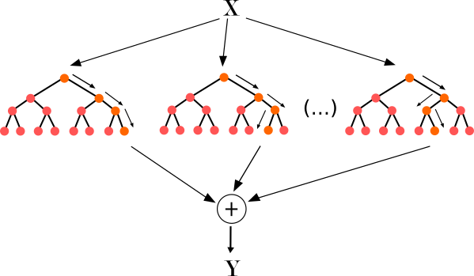

Los bosques aleatorios consisten simplemente en la generación de un número de árboles de decisión cuyos nodos adoptan condiciones diferentes para decidir sobre el mismo conjunto de datos de entrada. 

El resultado del bosque aleatorio será el promedio del resultado de los *n* árboles que conformen el bosque.


Escenario del problema
---


Vamos a contratar un nuevo empleado. Nos ha dicho que en su anterior empresa fue Manager Regional durante 2 años y que cobraba 170.000€ al año. Queremos determinar hasta que punto nos dice la verdad para poder negociar con él el salario que queremos ofrecerle en su nuevo puesto.  
¡Vamos a ello!

```{r 1. Importar librerías}
# 1. Importar librerías
library(caTools)
library(ggplot2)
library(randomForest)    # Librería que usaremos para crer el Bosque
```

```{r 2. Importar datos}
# 2. Importar datos
datos <- read.csv('../Datos/4.1.Salarios2.csv')
datos <- datos[2:3] # Eliminamos la columna del título del puesto y nos quedamos con el nivel
head(datos, 10)
```
Vemos como NO existe una tendencia lineal

```{r # 3. Separar en Entrenamiento y Validación}
# 3. Separar en Entrenamiento y Validación
```
**Recordatorio:** no hacemos división de conjuntos porque tenemos muy pocos datos y nuestra intención es hacer una predicción lo más precisa posible.

```{r # 4. Construir el Modelo}
# 4. Construir el Modelo
bosque <- randomForest::randomForest(formula = Salario ~ Nivel,
                                     data = datos,
                                     ntree = 10)
```

```{r 5. Hacer las prediciones para el conjunto de Validación}
# 5. Hacer las prediciones para el conjunto de Validación
y_fit  <- predict(bosque, newdata = datos)
y_pred <- predict(bosque, data.frame(Nivel = 6.5))
print(y_pred)
```
No estamos prediciendo en este ejemplo, sino determinando los parámetros para que el modelo se **ajuste** lo mejor posible a los datos del conjunto de entrenamiento (que constitutye todos los datos)

```{r 6. Echemos un vistazo a la pinta que tienen las predicciones}
# 6. Echemos un vistazo a la pinta que tienen las predicciones
ggplot() +
  geom_point(aes(datos$Nivel, datos$Salario), colour='red') +
  geom_line(aes(datos$Nivel, y_fit), colour='blue') +
  ggtitle('Regresión por Bosque Aleatorio') +
  xlab('Años de experiencia') +
  ylab('Salario')
```

¡Acuérdate de la resolución!

```{r 7. Subir la resolución del gráfico}
# 5. Hacer las prediciones para el conjunto de Validación
x_grid  =  seq(min(datos$Nivel), max(datos$Nivel), 0.01)
y_fit2  <- predict(bosque, newdata = data.frame(Nivel = x_grid))
y_pred2 <- predict(bosque, newdata = data.frame(Nivel = 6.5))
print(y_pred2)

# 6. Echemos un vistazo a la pinta que tienen las predicciones
ggplot() +
  geom_point(aes(datos$Nivel, datos$Salario), colour='red') +
  geom_line(aes(x_grid, y_fit2), colour='blue') +
  ggtitle('Regresión por Bosque Aleatorio') +
  xlab('Años de experiencia') +
  ylab('Salario')
```
Esto es lo que realmente está haciendo el árbol de decisión

```{r 7. Calcular el error}
# 7. Calcular el error
library(Metrics)
y_real <- datos$Salario
RMSE <- rmse(y_real, y_fit)
print(RMSE)
```


