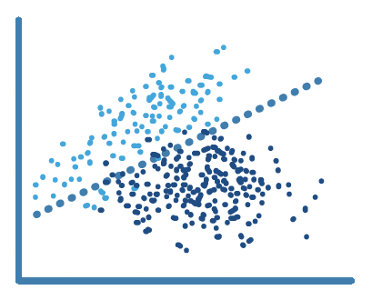

La regresión logísitica es un modelo que puede predecir la probabilidad que tiene una variable binaria (que puede aceptar 2 valores) de pertenecer a una clase o a otra.  

Es por tanto un método utilizado para la clasificación categórica de variables, especialmente útil por su simplicidad e interpretabilidad


Escenario del problema
---


Una empresa de coches ha sacado un nuevo modelo al mercado. Le ha preguntado a una red social quién ha comprado el producto, recaudando el sexo, la edad y el salario de cada uno de ellos.  
Ahora queremos construir un modelo que nos permita determinar con estos atributos si la persona comprará el producto o no, para tomar medidas en función de la respuesta para que lo acabe comprando.
¡Vamos a ello!

```{r 1. Importar librerías}
# 1. Importar librerías
library(caTools)
library(ggplot2)
library(rpart)    # Librería que usaremos para crer el Árbol
```

```{r 2. Importar datos}
# 2. Importar datos
datos <- read.csv('../Datos/4.1.Salarios2.csv')
datos <- datos[2:3] # Eliminamos la columna del título del puesto y nos quedamos con el nivel
head(datos, 10)
```
Vemos como NO existe una tendencia lineal

```{r # 3. Separar en Entrenamiento y Validación}
# 3. Separar en Entrenamiento y Validación
```
**Recordatorio:** no hacemos división de conjuntos porque tenemos muy pocos datos y nuestra intención es hacer una predicción lo más precisa posible.

```{r # 4. Construir el Modelo}
# 4. Construir el Modelo
arbol <- rpart::rpart(formula = Salario ~ Nivel,
                                data = datos)
```

```{r 5. Hacer las prediciones para el conjunto de Validación}
# 5. Hacer las prediciones para el conjunto de Validación
y_fit  <- predict(arbol, newdata = datos)
y_pred <- predict(arbol, data.frame(Nivel = 6.5))
```
No estamos prediciendo en este ejemplo, sino determinando los parámetros para que el modelo se **ajuste** lo mejor posible a los datos del conjunto de entrenamiento (que constitutye todos los datos)

```{r 6. Echemos un vistazo a la pinta que tienen las predicciones}
# 6. Echemos un vistazo a la pinta que tienen las predicciones
ggplot() +
  geom_point(aes(datos$Nivel, datos$Salario), colour='red') +
  geom_line(aes(datos$Nivel, y_fit), colour='blue') +
  ggtitle('Regresión por Árbol de Decisión') +
  xlab('Años de experiencia') +
  ylab('Salario')
```

¡Trampa! Nuestro árbol ha hecho 1 sola división y ha cogido el valor medio. Tenemos que forzar al árbol ha hacer un mínimo de divisiones. Volvamos a configurarlo

```{r 7. Reconstruir el Modelo}
# 4. Construir el Modelo
arbol2 <- rpart::rpart(formula = Salario ~ Nivel,
                       data = datos,
                       control = rpart.control(minsplit = 1))
 
# 5. Hacer las prediciones para el conjunto de Validación
y_fit2  <- predict(arbol2, newdata = datos)
y_pred2 <- predict(arbol2, data.frame(Nivel = 6.5))

# 6. Echemos un vistazo a la pinta que tienen las predicciones
ggplot() +
  geom_point(aes(datos$Nivel, datos$Salario), colour='red') +
  geom_line(aes(datos$Nivel, y_fit2), colour='blue') +
  ggtitle('Regresión por Árbol de Decisión') +
  xlab('Años de experiencia') +
  ylab('Salario')
```

El modelo de árboles de decisión es un modelo de regresión **discontínuo**.
Para poder verlo, necesitamos hacer un aumento de resolución.

```{r}
# 5. Hacer las prediciones para el conjunto de Validación
x_grid =  seq(min(datos$Nivel), max(datos$Nivel), 0.01)
y_fit3 <- predict(arbol2, newdata = data.frame(Nivel = x_grid))
#y_fit3 <- predict(arbol2, newdata = data.frame(Nivel = x_grid))

# 6. Echemos un vistazo a la pinta que tienen las predicciones
ggplot() +
  geom_point(aes(datos$Nivel, datos$Salario), colour='red') +
  geom_line(aes(x_grid, y_fit3), colour='blue') +
  ggtitle('Regresión por Árbol de Decisión') +
  xlab('Años de experiencia') +
  ylab('Salario')
```
Esto es lo que realmente está haciendo el árbol de decisión

```{r 7. Calcular el error}
# 7. Calcular el error
library(Metrics)
y_real <- datos$Salario
RMSE <- rmse(y_real, y_fit2)
print(RMSE)
```


```{r 8. Pintar el Árbol}
# 8. Pintar el árbol resultante
plot(arbol2)
text(arbol2)
```


