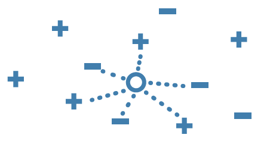

El algortimo kNN categoriza los puntos en función de la clase a la que pertenecen sus vecinos más cercanos.  
Toma una distancia (lineal por ejemplo) a un conjunto de vecinos en un radio delimitado, y compara cual es la clase predominante para convertirse en uno más de esa clase

Escenario del problema
---


Una empresa de coches ha sacado un nuevo modelo al mercado. Le ha preguntado a una red social quién ha comprado el producto, recaudando el sexo, la edad y el salario de cada uno de ellos.  
Ahora queremos construir un modelo que nos permita determinar con estos atributos si la persona comprará el producto o no, para tomar medidas en función de la respuesta para que lo acabe comprando.
¡Vamos a ello!

```{r 1. Importar librerías}
# 1. Importar librerías
library(caTools)
library(ggplot2)
library(class)         # Nos va a permitir general el modelo SVM 
library(ElemStatLearn) # Nos va a permitir dibujar las clasificaciones
```

```{r 2. Importar datos}
# 2. Importar datos
datos <- read.csv('../Datos/4.2.Compras.csv')
datos <- datos[3:5] # Eliminamos la columna del sexo
# 2.1. Codificiar la respuesta como categórica (factores en R)
datos$Compra <- factor(datos$Compra,
                levels = c(0, 1),
                labels = c(0, 1))
head(datos, 5)
```
Compra puede ser 0 (compró) o 1 (no compró) --> Distribución binomial (Bernouilli)

```{r # 3. Separar en Entrenamiento y Validación}
# 3. Separar en Entrenamiento y Validación
set.seed(123)
split <- sample.split(datos$Compra, SplitRatio = 0.75)
train <- subset(datos, split==TRUE)
test  <- subset(datos, split==FALSE)
dim(train)/dim(test)
```

```{r 4. Escalar los datos}
# 4. Hacer las prediciones para el conjunto de Validación
train[-3] <- scale(train[-3])
test[-3]  <- scale(test[-3])
```


```{r 5. Construir el Modelo}
# 5. Construir el Modelo y Predecir (kNN lo hace todo junto)
y_pred <- class::knn(train[ ,-3], test[ ,-3], 
                           cl = train[ ,3],
                           k = 5,
                           prob = TRUE)
```


```{r 6. Evaluar la calidad de las predicciones}
# 6. Hacer la matriz de confusión
cm = table(test[ , 3], y_pred)
cm
```


```{r 7. Echemos un vistazo a la pinta que tienen las predicciones}
# 7. Echemos un vistazo a la pinta que tienen las predicciones
# 7.1. Conjunto de entrenamiento
set = train
X1 = seq(min(set[, 1]) - 1, max(set[, 1]) + 1, by = 0.01)
X2 = seq(min(set[, 2]) - 1, max(set[, 2]) + 1, by = 0.01)
grid_set = expand.grid(X1, X2)
colnames(grid_set) = c('Edad', 'Salario')
y_grid = class::knn(train[ ,-3], grid_set, cl = train[ ,3], k = 5)
plot(set[, -3],
     main = 'SVM (Conjunto de entrenamiento)',
     xlab = 'Edad', ylab = 'Salario',
     xlim = range(X1), ylim = range(X2))
contour(X1, X2, matrix(as.numeric(y_grid), length(X1), length(X2)), add = TRUE)
points(grid_set, pch = '.', col = ifelse(y_grid == 1, 'springgreen3', 'tomato'))
points(set, pch = 21, bg = ifelse(set[, 3] == 1, 'green4', 'red3'))

# 7.2. Conjunto de validación
set = test
X1 = seq(min(set[, 1]) - 1, max(set[, 1]) + 1, by = 0.01)
X2 = seq(min(set[, 2]) - 1, max(set[, 2]) + 1, by = 0.01)
grid_set = expand.grid(X1, X2)
colnames(grid_set) = c('Edad', 'Salario')

y_grid = class::knn(train[ ,-3], grid_set, cl = train[ ,3], k = 5)
plot(set[, -3],
     main = 'SVM (Conjunto de entrenamiento)',
     xlab = 'Edad', ylab = 'Salario',
     xlim = range(X1), ylim = range(X2))
contour(X1, X2, matrix(as.numeric(y_grid), length(X1), length(X2)), add = TRUE)
points(grid_set, pch = '.', col = ifelse(y_grid == 1, 'springgreen3', 'tomato'))
points(set, pch = 21, bg = ifelse(set[, 3] == 1, 'green4', 'red3'))
```
